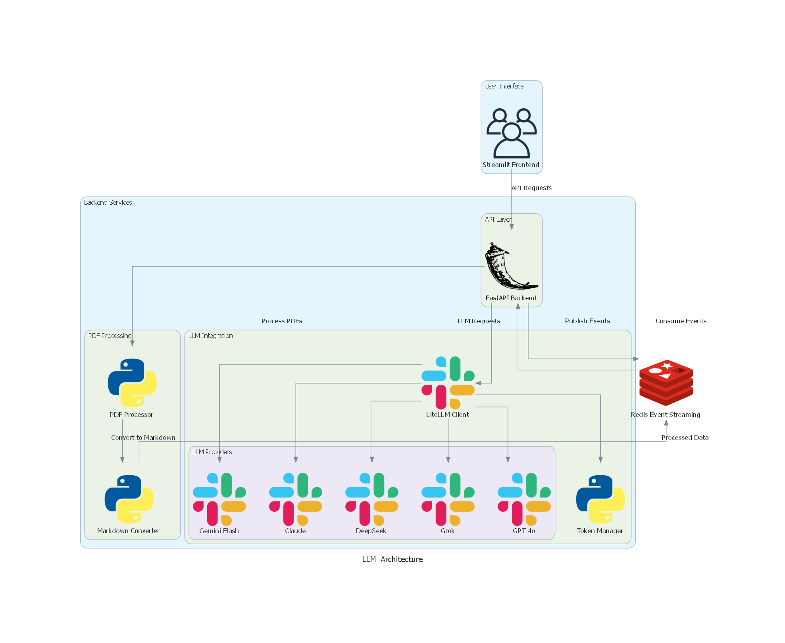

---

id: pdf-processing-llm 

title: "AI-Powered Document Processing Pipeline with PDF Extraction"

summary: "A codelab for integrating LLMs with PDF processing using FastAPI and Streamlit."

authors: ["Group 1"]

categories: ["AI", "PDF Scraping", "Cloud"]

environments: ["Web"]

status: "Published"

---

# Codelab: Building a Streamlit Application with FastAPI and LiteLLM for LLM Integration

## Overview
This codelab will guide you through the process of building a Streamlit application that integrates Large Language Models (LLMs) using FastAPI as an intermediary and LiteLLM for API management. The application will allow users to upload PDF documents, summarize their content, and ask questions about the documents.



---

## Installation & Setup

### **1️⃣ Prerequisites**
Ensure you have the following installed:
- Python ≥ 3.9
- Docker & Docker Compose
- API keys for LLM providers (store these in a `.env` file)

### **2️⃣ Clone the Repository**
```

git clone https://github.com/DAMG-7245/assignment_4-1.git

```

### **3️⃣ Create a Virtual Environment**
For macOS/Linux:
```

python -m venv venv
source venv/bin/activate

```
For Windows:
```

python -m venv venv
venv\Scripts\activate

```

### **4️⃣ Install Dependencies**
```

pip install -r requirements.txt

```

### **5️⃣ FastAPI Setup**
- Ensure FastAPI is included in your project dependencies (`requirements.txt`).
- Create a `main.py` file to define your FastAPI endpoints.

### **6️⃣ Docker Setup**
- Write a `Dockerfile` for both the Streamlit and FastAPI services.
- Use `docker-compose.yml` to define multi-container deployment.

Start the containers:
docker-compose up --build
---

## LLM Lite


Explain how to integrate LiteLLM for managing API calls to LLM providers. Include steps for:
- Setting up LiteLLM.
- Managing API keys.
- Handling token pricing and error logging.

---

## Streamlit Frontend

Guide for building the user interface in Streamlit. Include:
- File upload feature.
- Dropdown menu to select parsed PDFs or upload new ones.
- Text input for user questions.
- Buttons for summarization and Q&A functionalities.
- Display areas for summaries and answers.

1. **File Upload Feature**:
Use `st.file_uploader()` to let users upload PDFs.
uploaded_file = st.file_uploader("Upload a PDF", type="pdf")

text

2. **Dropdown Menu**:
Use `st.selectbox()` to select previously processed PDFs.
selected_pdf = st.selectbox("Choose a PDF:", pdf_list)

text

3. **Text Input for Questions**:
Use `st.text_input()` to accept user queries.
question = st.text_input("Ask a question about the document:")

text

4. **Buttons for Actions**:
Add buttons for summarization and Q&A functionalities.
if st.button("Summarize"):
# Call summarization endpoint here.
pass

if st.button("Ask Question"):
# Call Q&A endpoint here.
pass

text

5. **Display Areas**:
Use `st.text_area()` or `st.markdown()` to display summaries or answers.

---

## FastAPI Backend


Instructions for setting up FastAPI with REST endpoints. Include:
- `/select_pdfcontent` endpoint: Select prior parsed content.
- `/upload_pdf` endpoint: Handle uploaded PDFs.
- `/summarize` endpoint: Generate summaries.
- `/ask_question` endpoint: Process user questions and return answers.

Example Endpoint for File Uploads:
from fastapi import FastAPI, File, UploadFile

app = FastAPI()

@app.post("/upload_pdf")
async def upload_pdf(file: UploadFile = File(...)):
content = await file.read()
return {"filename": file.filename, "content_length": len(content)}

---

## Endpoint Utils

### Supporting Functions for Backend Operations

1. **Parsing PDF Files**:
   Use libraries like `pdfplumber` to extract text from PDFs.

2. **Interfacing with Redis Streams**:
   Publish and consume messages using Redis streams.

3. **Formatting JSON Responses**:
   Ensure consistent response formatting for all endpoints.


---

## API Endpoints

### Example Requests and Responses:

#### 1️⃣ `/select_pdfcontent`
- Method: GET  
- Description: Retrieve parsed content of a selected PDF.

#### 2️⃣ `/upload_pdf`
- Method: POST  
- Description: Upload and process a new PDF file.

#### 3️⃣ `/summarize`
- Method: POST  
- Description: Generate summaries from uploaded or selected PDFs.

#### 4️⃣ `/ask_question`
- Method: POST  
- Description: Answer user questions based on PDF content.


---

## Execution and Streamlit Run

Steps to execute the application:
1. Start Docker containers using `docker-compose up`.
2. Run the FastAPI backend using `uvicorn`.
3. Launch the Streamlit frontend with `streamlit run app.py`.
4. Access the application via the provided URL.

--- 

## Conclusion
This codelab demonstrates how to build an AI-powered application that integrates Streamlit, FastAPI, and LiteLLM for seamless interaction with LLMs and PDFs. By following these steps, you can create a robust system for document summarization and question answering powered by state-of-the-art AI technologies.

--- 

**End of Codelab**
```

